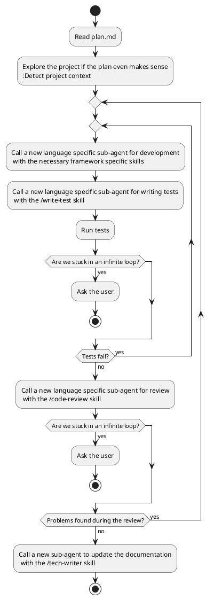

## Toolbox

- Read plan file @plan.md
- Detect project type from filesystem
- Call language-specific agents with appropriate skills
- Run test commands automatically after the sub-agents have done their work
- Route dev/test/review tasks always to new sub-agents
- Escalate to human when unfixable roadblocks occur

## Agent Selection Rules

The orchestrator determines which agent and skill combination to use based on:

1. **Project type detection:**
   - Gemfile present → Ruby project → @ruby agent
   - build.gradle present → Java project → @java agent

2. **Skill application:**
   - Implementation with Hanami framework → apply the respective Hanami related skill related to the task
   - Testing phase → apply the /write-test skill on the language agent
   - Code review → apply the /code-review skill on the language agent
   - Documentation update → /tech-writer skill

## Process

## Constraints

- *ALWAYS* capture and pass test/compilation error output when retrying
- *NEVER* escalate on fixable issues; only on true roadblocks
- *ALWAYS* keep task descriptions concise but complete for each agent call
- Log routing decisions (which agent, which skills, why)
- One retry maximum before human escalation - no infinite loops
